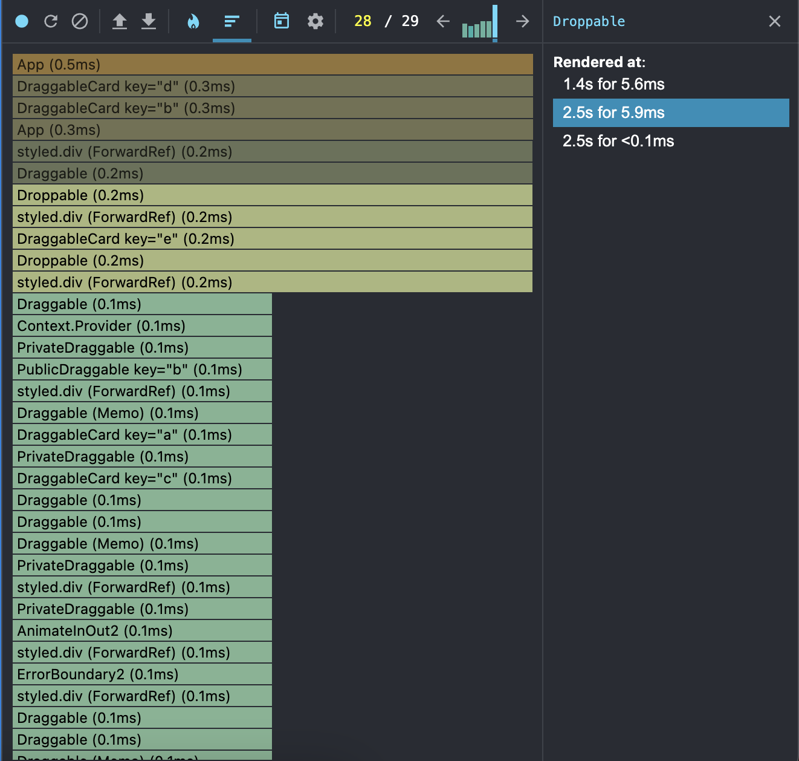
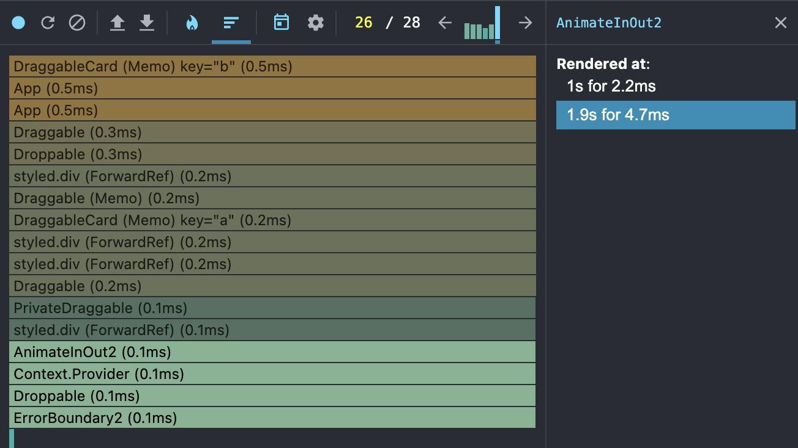
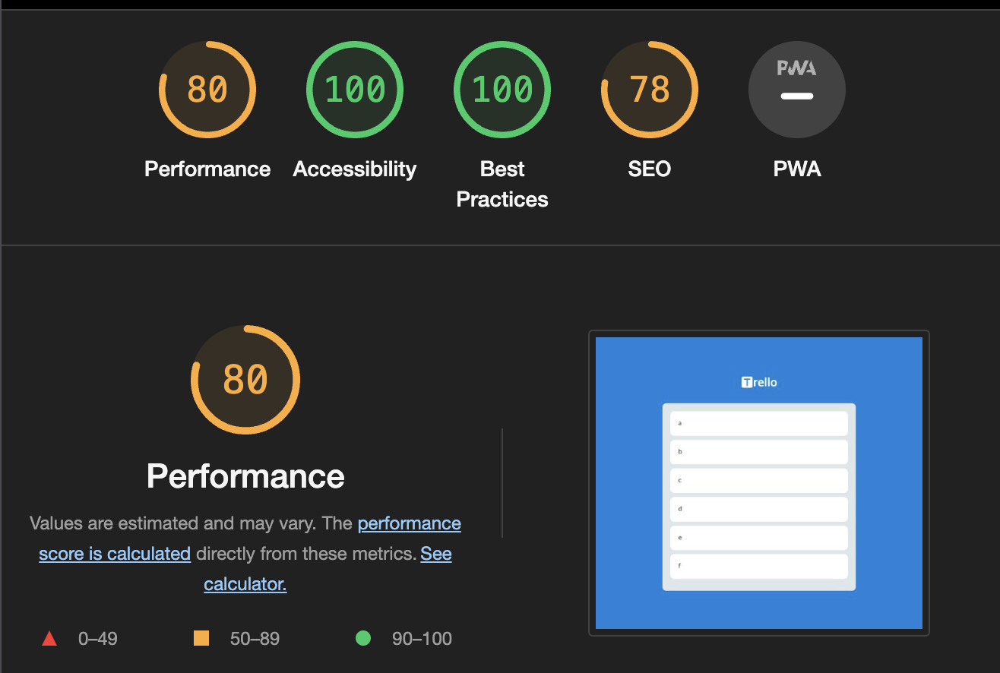
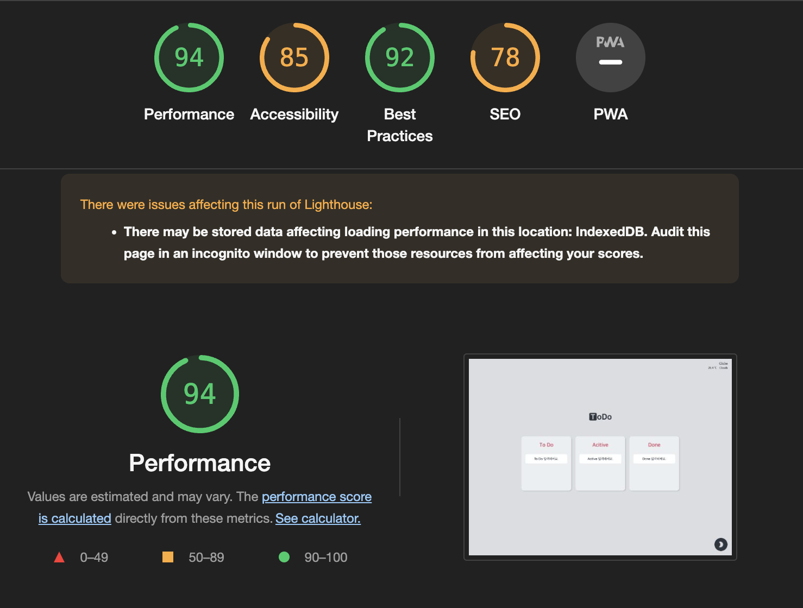

# 칸반보드 - Todo v2.0

|        스택         |     설명     |
| :-----------------: | :----------: |
|     TypeScript      |  타입 관리   |
|       Recoil        |  상태 관리   |
|  Styled-components  | 스타일 관리  |
|   react-hook-form   |   폼 관리    |
| react-beautiful-dnd | 드래그앤드롭 |

 

## 목적

\- 저번에 TodoList 토이 프로젝트 만들고 나서, 이번에는 칸반보드를 만들어보고 싶었다.

\- TodoList version 2.0

|       version 1       |        version 2        |
| :-------------------: | :---------------------: |
|          CRA          |          Vite           |
|   다양한 라이브러리   |     라이브러리 연습     |
|      select 태그      | 드래그앤드롭 라이브러리 |
|      성능 측정 X      |       성능 측정 O       |
|      다크 모드 X      |       다크 모드 O       |
| 배열 하나에 모든 atom |       객체별 atom       |

 

## 이슈

- DND 사용이유?

  \- DragDrop은 HTML5에서 지원해주는 window API이다.

  \- `하지만 단점` 존재 → 터치 X, 브라우저 마다 상이함, DOM 추가

  \- `해결` React-DND가 나옴 → 가상 Virtual DOM

  \- 자연스러운 움직임을 추가 → react-beautiful-dnd

 

\- 설계를 할 때 쉽게 구현하기 위해 배열로만 atom을 관리했는데, 카테고리별 구현을 위해 `객체로 변경`하면서 타입과 알고리즘이 많이 바뀌었다.

\- 드랍 이벤트 발생 시 모든 State가 재렌더링하면서 `속도와 렌더링 문제`가 있었다.

\- 날씨 구현을 라이브러리가 아니라 `window API로 직접 구현`하고 싶었으며, 한 컴포넌트에 한가지 기능만 담고 싶어서 리펙토링 하였다.

 

## 성능 개선

|                          Before                          |                          After                           |
| :------------------------------------------------------: | :------------------------------------------------------: |
|                          11.6ms                          |                          6.9ms                           |
|  |  |
|                           80%                            |                           96%                            |
|  |  |
|         props 변화에 따른 상속 렌더링 개선 필요          |       Recoil를 통한 별개의 상태관리로 영향을 개선        |
|           드랍할 때마다 Card 재렌더링 성능저하           |        React Memo hook을 통해 props변화만 렌더링         |
