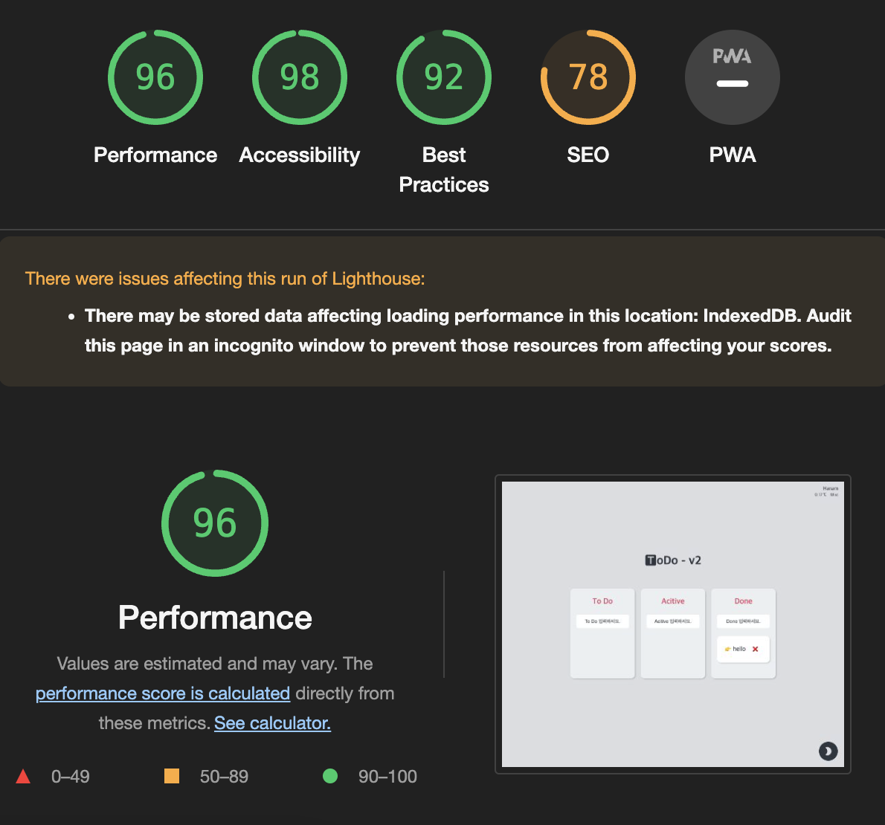

# 칸반보드 - Todo v2.0

## 0. 목적

\- 저번에 TodoList 토이 프로젝트 만들고 나서, 이번에는 칸반보드를 만들어보고 싶었다.

\- TodoList version 2.0의 차별점

|       version 1       |        version 2        |
| :-------------------: | :---------------------: |
|          CRA          |          Vite           |
|   다양한 라이브러리   |     라이브러리 연습     |
|      select 태그      | 드래그앤드롭 라이브러리 |
|      성능 측정 X      |       성능 측정 O       |
|      다크 모드 X      |       다크 모드 O       |
| 배열 하나에 모든 atom |       객체별 atom       |

 

## 1. 기술 스택

|        스택         |     설명     |                                   사용 이유                                    |
| :-----------------: | :----------: | :----------------------------------------------------------------------------: |
|     TypeScript      |  타입 관리   |                            유형 추론하여 에러 방지                             |
|       Recoil        |  상태 관리   |        상태관리 라이브러리 중에 간단하고 React스러운 것을 사용하기 위함        |
|  Styled-components  | 스타일 관리  |                컴포넌트 단위로 스타일 관리 & nesting으로 편리함                |
|   react-hook-form   |   폼 관리    | 이 프로젝트에서는 크게 의미는 없지만 수많은 form을 다루는 경우가 궁금해서 사용 |
| react-beautiful-dnd | 드래그앤드롭 |    칸반보드에서 필수적인 기능이라고 생각, 자연스러운 움직임이 존재하여 사용    |
|    framer-motion    |  애니메이션  |          애니메이션을 아주 간단하고 컴포넌트스러운 것을 사용하기 위함          |

 

## 2. 프로그램 구조

 

## 3. 이슈와 고민

\- 설계를 할 때 쉽게 구현하기 위해 배열로만 atom을 관리했는데, 카테고리별 구현을 위해 `객체로 변경`하면서 타입과 알고리즘이 많이 바뀌었다.

\- 드랍 이벤트 발생 시 모든 State가 재렌더링하면서 `속도와 렌더링 문제`가 있었다.

\- 날씨 구현을 라이브러리가 아니라 `Web API로 직접 구현`하고 싶었으며, 한 컴포넌트에 한가지 기능만 담고 싶어서 리펙토링 하였다.

\- (추가 23.02.02) 기능을 추가하면서 재사용하지 않은 것을 리펙토링을 어떻게 해야할지 아직 모르겠다. 기능 분리가 필요한지 좀 더 고민.

 

## 4. 성능 개선

|                          Before                          |                          After                           |
| :------------------------------------------------------: | :------------------------------------------------------: |
|                          11.6ms                          |                          6.9ms                           |
|  |  |
|                           80%                            |                           96%                            |
|  |  |
|         props 변화에 따른 상속 렌더링 개선 필요          |       Recoil를 통한 별개의 상태관리로 영향을 개선        |
|           드랍할 때마다 Card 재렌더링 성능저하           |        React Memo hook을 통해 props변화만 렌더링         |

 

## 5. 후기

\- 테스트 코드를 작성하지 못했다. 다음에는 테스트 코드를 작성해보고 싶다. (테스트 공부 필요)

\- 마주친 에러와 해결과정을 기록하지 못했다. (세심한 기록 필요)

\- 다양한 라이브러리를 사용하면서 기술을 익혔지만 깊게 공부하지 못했다. (기본기, 도큐먼트 공부 필요)

\- 리팩토링의 분리의 개념이 부족한것 같다. (리팩토링 공부 필요)

 

## 6. 추가 업데이트

\- 삭제 기능 (23.01.15)

\- 수정 기능 (23.02.02)

\- 애니메이션 (23.02.02)
